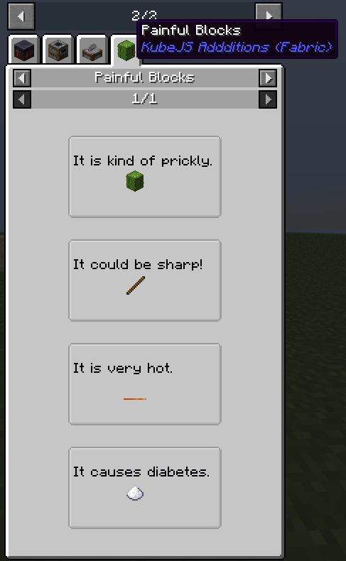
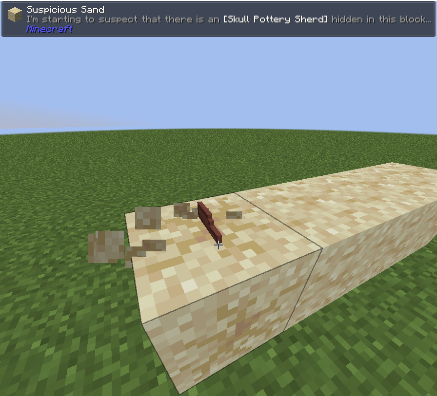

# KubeJS Additions

## About

This is a mod that aims to add some additional events, wrappers,
and functionality to KubeJS that aren't worth PRing into KubeJS itself
or just take too long as a PR to get merged.

## *Most Recent Addition*:

### Custom JEI Categories & Recipe Types.



## Custom JEI Category Example

### [JEIEvents.registerCategories](https://github.com/Hunter19823/kubejsadditions/blob/1.20.1/common/src/main/java/pie/ilikepiefoo/compat/jei/events/RegisterCategoriesEventJS.java)  (Client Only)

```js
JEIAddedEvents.registerCategories((event) => {
    // Register a new CustomCategory with the id "kubejsadditions:painful_blocks".
    event.custom("kubejsadditions:painful_blocks", (category) => {
        // Set the title of the category to "Painful Blocks".
        category.title("Painful Blocks")
                // Set the background of the category to a blank 100x50 drawable canvas.
                .background(guiHelper.createBlankDrawable(100, 50))
                // Set the icon of the category to a cactus item.
                .icon(guiHelper.createDrawableItemStack(Item.of('minecraft:cactus')))
                // Set the callback function that will verify if a recipe is a valid recipe for this category.
                .isRecipeHandled((recipe) => {
                    return global["verifyRecipe"](category.jeiHelpers, recipe);
                })
                // Set the callback function that will allow JEI to index this recipe and determine
                // what the inputs and outputs of each recipe are.
                .handleLookup((builder, recipe, focuses) => {
                    global["handleLookup"](category.jeiHelpers, builder, recipe, focuses);
                })
                // Set the callback function for rendering additional detials to the screen.
                .setDrawHandler((recipe, recipeSlotsView, guiGraphics, mouseX, mouseY) => {
                    global["renderPainfulBlocks"](category.jeiHelpers, recipe, recipeSlotsView, guiGraphics, mouseX, mouseY);
                })
    });
});
```

### [RecipeCategoryBuilder.IsRecipeHandled](https://github.com/Hunter19823/kubejsadditions/blob/f541be151f96745a0a184c5b3b8c48b0a07a83b3/common/src/main/java/pie/ilikepiefoo/compat/jei/builder/RecipeCategoryBuilder.java#L268-L273)

```js
// This function will be used by JEI to verify if a custom recipe is apart of this category.
global["verifyRecipe"] = (jeiHelpers, recipe) => {
    // The data we give later on in the recipes will be stored in the `data` field.
    // Whatever you pass in, is whatever you'll get out.
    // The possibilities are endless, as you are only restricted to what you can store on
    // the KubeJS client side.

    // IMPORTANT: Always return true or false. If you do not, it could crash the game or cause
    // JEI to not work properly.
    if (!recipe) return false;
    if (!recipe.data) return false;
    if (!recipe.data.type) return false;
    if (!recipe.data.name) return false;

    return !!recipe.data.description;
}
```

### [RecipeCategoryBuilder.handleLookup](https://github.com/Hunter19823/kubejsadditions/blob/f541be151f96745a0a184c5b3b8c48b0a07a83b3/common/src/main/java/pie/ilikepiefoo/compat/jei/builder/RecipeCategoryBuilder.java#L203-L211)

```js
// JEI needs to understand what sort of information is held within
// the recipe. This is where you can define different types of slots,
// where they should go, if they are input, output, catalysts, or neither.
// Depending on the slot type, it will effect if the recipe appears in
// in the recipe lookup.
// Refer to the JEI API for more information on how to use this.
global["handleLookup"] = (jeiHelpers, builder, recipe, focuses) => {
    switch (recipe.data.type) {
        case "item":
        case "block":
            // Add an input slot to the recipe that is 35 pixels from the left and 20 pixels from the top.
            // Name the slot "input" so that if we want to reference it in the draw handler, we can.
            builder.addSlot("INPUT", 35, 20).addItemStack(Item.of(recipe.data.name)).setSlotName("input");
            // Add an invisible output slot so that if you look at how the item is made, it shows this recipe.
            builder.addInvisibleIngredients("OUTPUT").addItemStack(Item.of(recipe.data.name))
            break;
        case "fluid":
            // Add an input slot to the recipe that is 35 pixels from the left and 20 pixels from the top.
            // This one is slightly different as we are adding a fluid to the slot instead of an Item.
            // you can chain these as much as you'd like and add as many different ingredients
            // as you'd like.
            builder.addSlot("INPUT", 35, 20).addFluidStack(recipe.data.name, 1000).setSlotName("input")
            // Add an invisible output slot so that if you look at how the item is made, it shows this recipe.
            builder.addInvisibleIngredients("OUTPUT").addFluidStack(recipe.data.name, 1000)
            break;
    }
}
```

### [RecipeCategoryBuilder.draw](https://github.com/Hunter19823/kubejsadditions/blob/f541be151f96745a0a184c5b3b8c48b0a07a83b3/common/src/main/java/pie/ilikepiefoo/compat/jei/builder/RecipeCategoryBuilder.java#L214-L231)

```js
// We tap into the Minecraft GuiGraphics class to draw the text description above the input slot.
global["renderPainfulBlocks"] = (jeiHelpers, recipe, recipeSlotsView, guiGraphics, mouseX, mouseY) => {
    // By using the Client binding we can get the Minecraft font.
    // Next we can draw the description of the recipe above the input slot.
    // The first argument is the font, the second is the FormattedText, the third is the x position,
    // the fourth is the y position, the fifth is the width of the text, and I have no clue what the last argument does.
    // Probably z-index if I had to guess.
    guiGraphics.drawWordWrap(Client.font, Text.of(recipe.data.description), 0, 10, 100, 0);
}
```

### [JEIEvents.registerRecipes](https://github.com/Hunter19823/kubejsadditions/blob/f541be151f96745a0a184c5b3b8c48b0a07a83b3/common/src/main/java/pie/ilikepiefoo/compat/jei/events/RegisterRecipesEventJS.java#L23-L27)  (Client Only)

```js
// Here we can hook into the JEI recipe registration event to add some recipes to our
// newly created category.
JEIAddedEvents.registerRecipes((event) => {
    // This utilized the new recipe category you made above here.
    // All that's left is to add as many different recipes as your heart desires.
    // There are no limitations to what you can store as a "recipe". Nothing that you don't control
    // cares about the format of the data.
    // If you want it to be an object, an array, a string, a number, a boolean, or even a function,
    // It does not matter. It's all up to you. Go wild.
    // Just make sure to update how you render it in the category definition.
    event.custom("kubejsadditions:painful_blocks")
            .add({name: 'minecraft:cactus', type: 'block', description: 'It is kind of prickly.'})
            .add({name: 'minecraft:stick', type: 'item', description: 'It could be sharp!'})
            .add({name: 'minecraft:lava', type: 'fluid', description: 'It is very hot.'})
            .add({name: 'minecraft:sugar', type: 'item', description: 'It causes diabetes.'})
    // .add([])
    // .add("")
    // .add(true)
    // .add(50)
    // .add(12.4)
    // .add(()=> Item.of('steak'))
});
```

### Jade Integration



As of version 4.1.0 of KubeJS Additions, you can now fully use Jade's WAILA Plugin API
to completely customize the information displayed by Jade.

Jade is a fork of HWYLA, which is a fork of WAILA.
These mod are the ones that adds information about the block you are looking at in the world, to the top of your screen.

Below you may find an example on how to use this to

#### [WailaCommonRegistrationEventJS](https://github.com/Hunter19823/kubejsadditions/blob/1.20.1/common/src/main/java/pie/ilikepiefoo/compat/jade/WailaCommonRegistrationEventJS.java) (Startup Only)

```js
// The following would go inside the startup scripts folder.
// This is a simple example of how to register a block data provider for a block entity.

// Load the BlockEntity Class that you will be providing data for.
const $BRUSHABLE_BLOCK_ENTITY = Java.loadClass('net.minecraft.world.level.block.entity.BrushableBlockEntity');

// Store a global function so that if we need to reload the function,
// we do not need to reload the game. Instead we can run /kubejs reload startup_scripts
global["JadeBrushableBlocksCallback"] = (tag, accessor) => {
    // Refer to the Jade API for more information on what accessors are.
    // This specific accessor is a BlockAccessor.
    const blockEntity = accessor.getBlockEntity();
    // Return in case there is no block entity
    if (!blockEntity) return;
    // Return in case the Brushable Block entity does not have an item.
    if (!blockEntity.getItem()) return;
    // Return in case the Brushable Block entity has an empty item.
    if (blockEntity.getItem().isEmpty()) return;
    // Store the item's name in the ServerData tag under the name "brushing_result".
    // Because we only need to conver the Item's name, we can convert the DisplayName componet
    // to a JSON object and store the string version of that in the tag.
    tag.putString("brushing_result", Item.of(blockEntity.getItem()).getDisplayName().toJson());
};

// This is the hook that will be called when the "IWailaPlugin" common registration event is fired.
// Refer to WailaCommonRegistrationEventJS for more information about the event.
JadeEvents.onCommonRegistration((event) => {
    // Register a new block data provider for the Brushable Block entity.
    event.blockDataProvider('kubejsadditions:brushable_block', $BRUSHABLE_BLOCK_ENTITY)
            // Our data provider is useless without a callback function.
            .setCallback((tag, accessor) => {
                // Fire the global function we defined earlier.
                global["JadeBrushableBlocksCallback"](tag, accessor);
            });
});
```

#### [WailaClientRegistrationEventJS](https://github.com/Hunter19823/kubejsadditions/blob/1.20.1/common/src/main/java/pie/ilikepiefoo/compat/jade/WailaClientRegistrationEventJS.java) (Client Only)

```js
// The following would go in the client scripts folder.
// This is a simple example on how to retrieve the data we registered in the startup scripts.

// Load the Block Class that you will be providing data for.
const $BRUSHABLE_BLOCK = Java.loadClass('net.minecraft.world.level.block.BrushableBlock');

// Store a global function so that if we need to reload the function,
// we do not need to reload the game. Instead we can run /kubejs reload client_scripts
global["JadeBrushableBlocksClientCallback"] = (tooltip, accessor, pluginConfig) => {
    // Refer to the Jade API for more information on what accessors are.
    // Get the server data from the accessor.
    const {serverData} = accessor;
    // Return in case there is no server data.
    if (!serverData) return;
    // Return in case the server data does not contain the key "brushing_result".
    if (!serverData.contains("brushing_result")) return;
    // Get the display name tag from the server data.
    // This should result in a StringTag being returned.
    const displayNameTag = serverData.get("brushing_result");
    // Have the TextWrapper binding convert the StringTag into a TextComponent.
    const displayName = Text.of(displayNameTag);
    // If the display name is null, return.
    if (!displayName) return;
    // Add the display name to the tooltip.
    tooltip.add(Text.of(["I'm starting to suspect that there is an ", Text.of(displayName), " hidden in this block..."]));
};

// This is the hook that will be called when the "IWailaPlugin" client registration event is fired.
// Refer to WailaClientRegistrationEventJS for more information about the event.
JadeEvents.onClientRegistration((event) => {
    // Register a new block component provider for the Brushable Block.
    event.block('kubejsadditions:brushable_block', $BRUSHABLE_BLOCK)
            .tooltip((tooltip, accessor, pluginConfig) => {
                // Fire the global function we defined earlier.
                global["JadeBrushableBlocksClientCallback"](tooltip, accessor, pluginConfig);
            });
});
```

## Features

For the most part, a lot of these additions are events, however, there are some type wrappers and bindings as well.

# [Bindings](https://github.com/Hunter19823/kubejsadditions/blob/1.19.2/common/src/main/java/pie/ilikepiefoo/AdditionsPlugin.java#L29)

- ### Damage Source
- ### Structures
- ### Feature

# [Type Wrappers](https://github.com/Hunter19823/kubejsadditions/blob/1.19.2/common/src/main/java/pie/ilikepiefoo/AdditionsPlugin.java#L35)

- ### Chunk Pos
	- Supports:
		- ChunkPos
		- BlockPos
		- Long
		- BlockContainerJS
		- Entity

# Events

## [Custom Architectury Event Listeners](https://github.com/Hunter19823/kubejsadditions/blob/3d489ddef363573218f68a8a7e34f924729fe1c2/common/src/main/java/pie/ilikepiefoo/events/AdditionalEvents.java#L17)

### Using the power of Proxy classes, this mod adds the ability to listen to any Architectury or Fabric event.

#### Architectury Event Register (Startup) (Cannot be reloaded without a restart)

The Architectury Registry Event is a special event that allows you to register events to the Architectury Event Bus.
This is useful for registering events that are not supported by KubeJS or addon mods.

```js
const LIFE_CYCLE_EVENTS = Java.loadClass('dev.architectury.event.events.common.LifecycleEvent');
ArchEvents.registry(event => {
	event.register('server starting', LIFE_CYCLE_EVENTS, 'SERVER_BEFORE_START');
});
```

The first part is to find and load a Java class that contains a public static field containing the Architectury Event you want to listen to.
In this example, that is the `LifecycleEvent` interface.
The second part is to find the field name of the event you want to listen to.
In this example, that is the `SERVER_BEFORE_START` field.
The third part is to register the event under an arbitrary name.
In this example, that is `server starting`.
See the below example for how to listen to the event.

#### Architectury Event Listen (Startup/Client/Server) (Reloadable)

```js
// See above for the first part of this example.
ArchEvents.handleServer('server starting', event => {
	console.log('Custom Arch Event handler has fired!');
	console.log("Event Class: " + event); // Returns the class of the event. (It's always a ProxyClass)
	console.log("Method Name: " + event.getMethodName()); // Returns the name of the method that fired the event.
	console.log("Parameter List: " + event.getArgs()); // Returns an array of parameters. Most likley will only show up as a list of objects.
	console.log("Parameter 0: " + event.getArg(0)); // Returns a specific parameter at the given index.
	console.log("Parameter Map: " + event.getParameters()); // Returns a map of parameters. Most parameter names will be "arg0", "arg1", etc.
	console.log("Requires Return: " + event.requiresReturn()); // Returns true if the event requires a return value.
	console.log("Return Type: " + event.getReturnType()); // Returns the type of the return value.
	console.log("Generic Return Type: " + event.getGenericReturnType()); // Returns the generic type of the return value.
	// Let's say the event requires a return value.
	// We can return a value like so:
	// event.setResult("Hello World!");
});
```

This example showcases how to listen to the event we registered above.
You use the name of the event you registered to listen to it.
The event parameter is an instance of the `ProxyClass` class.
You can listen to any event from any script context (Startup, Client, Server) with the same syntax.

***Important Note for KubeJS Additions 4.0.0+ (Mc 1.20+)***:

Due to changes with KubeJS Event handlers, `ArchEvents.handle` has been split into `ArchEvents.handleClient`, `ArchEvents.handleServer`, and `ArchEvents.handleStartup` for each script type respectively.
The syntax is the same as the above example, however, you must use the correct method for the script type you are using.

For previous versions of KubeJS Additions, you can use `ArchEvents.handle` for all script types.

## [Custom Fabric Event Listeners](https://github.com/Hunter19823/kubejsadditions/blob/3d489ddef363573218f68a8a7e34f924729fe1c2/fabric/src/main/java/pie/ilikepiefoo/fabric/FabricEventsJS.java#L60)

#### Fabric Event Register (Startup) (Cannot be reloaded without a restart)

The FabricEvents Registry Event is a special event that allows you to register events to the Fabric Event Bus.
This is useful for registering events that are not supported by KubeJS or addon mods.

```js
const SERVER_MESSAGES = Java.loadClass('net.fabricmc.fabric.api.message.v1.ServerMessageEvents');
FabricEvents.registry(event => {
	event.register('chat messages', SERVER_MESSAGES, 'CHAT_MESSAGE');
});
```

The first part is to find and load a Java class that contains a public static field containing the Fabric Event you want to listen to.
In this example, that is the `ServerMessageEvents` interface.
The second part is to find the field name of the event you want to listen to.
In this example, that is the `CHAT_MESSAGE` field.
The third part is to register the event under an arbitrary name.
In this example, that is `chat messages`.
See the below example for how to listen to the event.

#### Fabric Events Event Listen (Startup/Client/Server) (Reloadable)

```js
// See above for the first part of this example.
FabricEvents.handleServer('chat messages', event => {
	console.log('Custom Arch Event handler has fired!');
	console.log("Event Class: " + event); // Returns the class of the event. (It's always a ProxyClass)
	console.log("Method Name: " + event.getMethodName()); // Returns the name of the method that fired the event.
	console.log("Parameter List: " + event.getArgs()); // Returns an array of parameters. Most likley will only show up as a list of objects.
	console.log("Parameter 0: " + event.getArg(0)); // Returns a specific parameter at the given index.
	console.log("Parameter Map: " + event.getParameters()); // Returns a map of parameters. Most parameter names will be "arg0", "arg1", etc.
	console.log("Requires Return: " + event.requiresReturn()); // Returns true if the event requires a return value.
	console.log("Return Type: " + event.getReturnType()); // Returns the type of the return value.
	console.log("Generic Return Type: " + event.getGenericReturnType()); // Returns the generic type of the return value.
	// Let's say the event requires a return value.
	// We can return a value like so:
	// event.setResult("Hello World!");
});
```

This example showcases how to listen to the event we registered above.
You use the name of the event you registered to listen to it.
The event parameter is an instance of the `ProxyClass` class.
You can listen to any event from any script context (Startup, Client, Server) with the same syntax.

***Important Note for KubeJS Additions 4.0.0+ (Mc 1.20+)***:

Due to changes with KubeJS Event handlers, `FabricEvents.handle` has been split into `FabricEvents.handleClient`, `FabricEvents.handleServer`, and `FabricEvents.handleStartup` for each script type respectively.
The syntax is the same as the above example, however, you must use the correct

For previous versions of KubeJS Additions, you can use `FabricEvents.handle` for all script types.

### [Common Events](https://github.com/Hunter19823/kubejsadditions/blob/1.19.2/common/src/main/java/pie/ilikepiefoo/events/AdditionalEvents.java)

#### Entity Enter Chunk (Server Only)

```js
CommonAddedEvents.entityEnterChunk(event => {
	console.log('Entity Enter Chunk event fired!');
	console.log(event);
});
```

#### Entity Tamed (Server Only)

```js
CommonAddedEvents.entityTame(event => {
	console.log('Entity Tame event fired!');
	console.log(event);
});
```

#### Player Changed Dimension (Server Only)

```js
CommonAddedEvents.playerChangeDimension(event => {
	console.log('Player Change Dimension event fired!');
	console.log(event);
});
```

#### Entity Cloned (Server Only)

```js
CommonAddedEvents.playerClone(event => {
	console.log('Player Clone event fired!');
	console.log(event);
});
```

#### Player Respawned. (Server Only)

```js
CommonAddedEvents.playerRespawn(event => {
	console.log('Player Respawn event fired!');
	console.log(event);
});
```

### [JEI Events](https://github.com/Hunter19823/kubejsadditions/blob/1.19.2/common/src/main/java/pie/ilikepiefoo/compat/jei/JEIEvents.java)

#### JEI Runtime Available (Client Only)

```js
JEIAddedEvents.onRuntimeAvailable(event => {
	console.log('Runtime Available event fired!');
	console.log(event);
});
```

#### JEI Register Advanced Recipe (Client Only)

```js
JEIAddedEvents.registerAdvanced(event => {
	console.log('Register Advanced event fired!');
	console.log(event);
});
```

#### JEI Register Recipe Category (Client Only)

```js
JEIAddedEvents.registerCategories(event => {
	console.log('Register Categories event fired!');
	console.log(event);
});
```

#### JEI Register Fluid Subtypes (Client Only)

```js
JEIAddedEvents.registerFluidSubtypes(event => {
	console.log('Register Fluid Subtypes event fired!');
	console.log(event);
});
```

#### JEI Register GUI Handlers (Client Only)

```js
JEIAddedEvents.registerGUIHandlers(event => {
	console.log('Register GUI Handlers event fired!');
	console.log(event);
});
```

#### JEI Register Ingredients (Client Only)

```js
JEIAddedEvents.registerIngredients(event => {
	console.log('Register Ingredients event fired!');
	console.log(event);
});
```

#### JEI Register Item Subtypes (Client Only)

```js
JEIAddedEvents.registerItemSubtypes(event => {
	console.log('Register Item Subtypes event fired!');
	console.log(event);
});
```

#### JEI Register Recipe Catalysts (Client Only)

```js
JEIAddedEvents.registerRecipeCatalysts(event => {
	console.log('Register Recipe Catalysts event fired!');
	console.log(event);
});
```

#### JEI Register Recipes (Client Only)

```js
JEIAddedEvents.registerRecipes(event => {
	console.log('Register Recipes event fired!');
	console.log(event);
});
```

#### JEI Register Recipe Transfer Handlers (Client Only)

```js
JEIAddedEvents.registerRecipeTransferHandlers(event => {
	console.log('Register Recipe Transfer Handlers event fired!');
	console.log(event);
});
```

#### JEI Register Vanilla Category Extensions (Client Only)

```js
JEIAddedEvents.registerVanillaCategoryExtensions(event => {
	console.log('Register Vanilla Category Extensions event fired!');
	console.log(event);
});
```

### [Fabric Events](https://github.com/Hunter19823/kubejsadditions/fabric/src/main/java/pie/ilikepiefoo/fabric/FabricEvents.java)

#### Fabric (Client Only)

```js
FabricAddedEvents.renderHUD(event => {
	console.log('Render HUD event fired!');
	console.log(event);
});
```

#### Fabric (Client Only)

```js
FabricAddedEvents.beforeEntities(event => {
	console.log('Before Entities event fired!');
	console.log(event);
});
```

#### Fabric (Client Only)

```js
FabricAddedEvents.afterEntities(event => {
	console.log('After Entities event fired!');
	console.log(event);
});
```

#### Fabric (Client Only)

```js
FabricAddedEvents.afterTranslucent(event => {
	console.log('After Translucent event fired!');
	console.log(event);
});
```

#### Fabric (Client Only)

```js
FabricAddedEvents.afterSetup(event => {
	console.log('After Setup event fired!');
	console.log(event);
});
```

#### Fabric Start Render Event (Client Only)

```js
FabricAddedEvents.startRender(event => {
	console.log('Start Render event fired!');
	console.log(event);
});
```

#### Fabric Last Render Event (Client Only)

```js
FabricAddedEvents.lastRender(event => {
	console.log('Last Render event fired!');
	console.log(event);
});
```

#### Fabric End Render Event (Client Only)

```js
FabricAddedEvents.endRender(event => {
	console.log('End Render event fired!');
	console.log(event);
});
```

#### Fabric Before BlockOutline Event (Client Only)

```js
FabricAddedEvents.beforeBlockOutline(event => {
	console.log('Before Block Outline event fired!');
	console.log(event);
});
```

#### Fabric BlockOutline Event (Client Only)

```js
FabricAddedEvents.blockOutline(event => {
	console.log('Block Outline event fired!');
	console.log(event);
});
```

#### Fabric Allow Elytra Flight Event (Server Only)

```js
FabricAddedEvents.allowElytraFlight(event => {
	console.log('Allow Elytra Flight event fired!');
	console.log(event);
});
```

#### Fabric Custom Elytra Flight Event (Server Only)

```js
FabricAddedEvents.customElytraFlight(event => {
	console.log('Custom Elytra Flight event fired!');
	console.log(event);
});
```

#### Fabric Allow Sleeping Event (Server Only)

```js
FabricAddedEvents.allowSleeping(event => {
	console.log('Allow Sleeping event fired!');
	console.log(event);
});
```

#### Fabric Start Sleeping Event (Server Only)

```js
FabricAddedEvents.startSleeping(event => {
	console.log('Start Sleeping event fired!');
	console.log(event);
});
```

#### Fabric Stop Sleeping Event (Server Only)

```js
FabricAddedEvents.stopSleeping(event => {
	console.log('Stop Sleeping event fired!');
	console.log(event);
});
```

#### Fabric Allow Bed Event (Server Only)

```js
FabricAddedEvents.allowBed(event => {
	console.log('Allow Bed event fired!');
	console.log(event);
});
```

#### Fabric Allow Sleep Time Event (Server Only)

```js
FabricAddedEvents.allowSleepTime(event => {
	console.log('Allow Sleep Time event fired!');
	console.log(event);
});
```

#### Fabric Allow Nearby Monsters Event (Server Only)

```js
FabricAddedEvents.allowNearbyMonsters(event => {
	console.log('Allow Nearby Monsters event fired!');
	console.log(event);
});
```

#### Fabric Allow Reseting Time Event (Server Only)

```js
FabricAddedEvents.allowResettingTime(event => {
	console.log('Allow Resetting Time event fired!');
	console.log(event);
});
```

#### Fabric Allow Modifying Sleeping Direction Event (Server Only)

```js
FabricAddedEvents.ModifySleepingDirection(event => {
	console.log('Modify Sleeping Direction event fired!');
	console.log(event);
});
```

#### Fabric Allow Setting Spawn Event (Server Only)

```js
FabricAddedEvents.allowSettingSpawn(event => {
	console.log('Allow Setting Spawn event fired!');
	console.log(event);
});
```

#### Fabric Allow Setting Bed Occupation State Event (Server Only)

```js
FabricAddedEvents.setBedOccupationState(event => {
	console.log('Set Bed Occupation State event fired!');
	console.log(event);
});
```

#### Fabric Allow Modifying Wake Up Position Event (Server Only)

```js
FabricAddedEvents.modifyWakeUpPosition(event => {
	console.log('Modify Wake Up Position event fired!');
	console.log(event);
});
```
